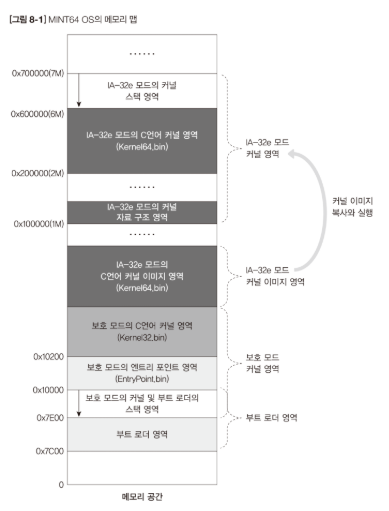

# bbi-os
64bit Multicore OS using Intel x86_64 

## bbi-os Memory Map


## Welcome to bbi-os
bbi-os is derived OS from [MINT64 OS](http://www.mint64os.pe.kr/) and written by C & x86_64 assembly languages 

## Contributing to bbi-os
Contributions to bbi-os are welcomed and encouraged! Please contact us if you want to contribute

## Getting Started
To build from source, you will need about 
- [binutils](https://ftp.gnu.org/gnu/binutils/)
- [gcc](https://ftp.gnu.org/gnu/gcc/)
- [nasm](https://www.nasm.us/)
- [qemu](https://www.qemu.org/download/)

## System Requirements
Windows, Linux, MacOS are the current supported host development operating systems.

## Cross-compiling gcc for MacOS
Cross-compiling gcc for macOS is very difficult. <br>
You can download cross compiled gcc from [here](http://crossgcc.rts-software.org/doku.php?id=compiling_for_linux)

## Build Tool
We will use Make as build tool, please install make for build <br>
If your host development OS is windows, install mingw64(I recommend using [chocolatey](https://chocolatey.org/))
- choco install mingw

## .vscode/launch.json
```
{
    // Use IntelliSense to learn about possible attributes.
    // Hover to view descriptions of existing attributes.
    // For more information, visit: https://go.microsoft.com/fwlink/?linkid=830387
    "version": "0.2.0",
    "configurations": [
        {
            "name": "(Windows) Launch",
            "type": "cppvsdbg",
            "request": "launch",
            "program": "${env:MSYS2_DIR}/usr/bin/bash",
            "args": ["./qemu.sh"],
            "stopAtEntry": false,
            "cwd": "${workspaceFolder}",
            "environment": [],
            "externalConsole": true
        }
    ]
}
```

## .vscode/tasks.json
```
{
    // See https://go.microsoft.com/fwlink/?LinkId=733558
    // for the documentation about the tasks.json format
    "version": "2.0.0",
    "tasks": [
        {
            "label": "Make",
            "type": "shell",
            "command": "make",
            "args": [],
            "options": {
                "cwd": "${workspaceFolder}"
            },
            "group": {
                "kind": "build",
                "isDefault": true
            }
        }
    ]
}
```
